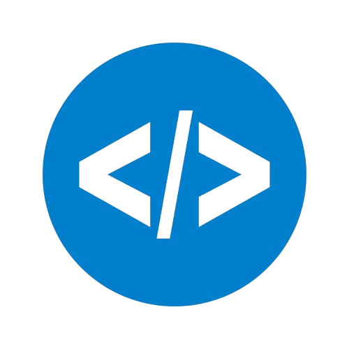

<h1>Hi, I'm Samuele Bini </h1>

🚀 I’m currently attending an IoT course and passionate about developing software to solve real-world problems.  
📫 My Discord profile: ZioS4mmy#6459 

## <b> Skills</b>

- **Coding languages:**

     
    
    
    
    

     

- **Tools**

    
    
    
    
    
    
    
    
    

    

<!--
**binisamuele/binisamuele** is a ✨ _special_ ✨ repository because its `README.md` (this file) appears on your GitHub profile.

Here are some ideas to get you started:

- 🔭 I’m currently working on ...
- 🌱 I’m currently learning ...
- 👯 I’m looking to collaborate on ...
- 🤔 I’m looking for help with ...
- 💬 Ask me about ...
- 📫 How to reach me: ...
- 😄 Pronouns: ...
- ⚡ Fun fact: ...
-->
